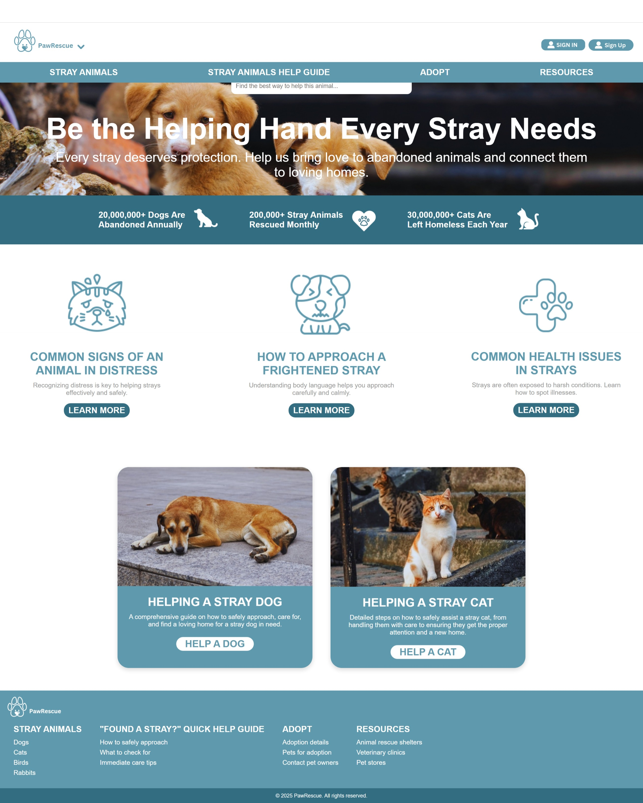

# **PawRescue**

**PawRescue**, a user-friendly website that bridges the gap between individuals offering pets for adoption, foster caregivers, small rescuers, or pet owners and the people seeking to adopt animals. The website will simplify the adoption process by enabling seamless profile creation, pet listings, and direct communication between parties. 

  

## Why PawRescue?
Streamlines the complex pet adoption process by providing a centralized platform where all parties can efficiently connect and communicate.

##  Demo

 Visit the [live demo](https://pawrescue-w77l.onrender.com) to see PawRescue in action

## ✨ Key Features

- **User Profiles** - Complete profiles for adopters and rescuers 
- **Pet Listings** - Detailed pet profiles with photos and care information
- **Responsive Design** - Optimized for all devices

## 📊 Technical Achievements

| Metric | Result |
|--------|--------|
| **User Experience** | Intuitive multi-user interface |
| **Performance** | Fast search and image loading |
| **Functionality** | profile systems |

## 🚀 Future Enhancements

- Mobile app development for iOS/Android
- AI-powered pet-adopter matching system

---

**Built with modern web technologies to create meaningful connections between pets and families.**

##  Connect With Me

